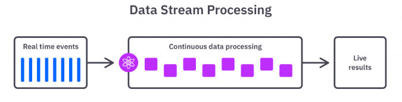

## Steam Data Solution 

### What is Steam Data  ?

Stream Data is a technique that allows processing data in real-time or near-real-time, where data is processed as a continuous stream rather than as fixed or static chunks. It enables handling of unbounded data, ensuring ordered data processing. Technologies like Redis Streams and Kafka Streams provide mechanisms to manage and process data in this streaming fashion, commonly used in data analytics, state monitoring, log processing, and various other real-time data processing scenarios.


<br>

----

### Table of contents

#### 1. Setup environment

* [Setup Docker and K8S](#setup-docker-and-k8s)

* [Setup Redis](#setup-redis)

* [Setup Kafka](#setup-kafka)

#### 2. Setup Monitor System

* [Setup Grafana](#setup-grafana)

* [Setup Loki](#setup-loki)

* [Setup Node Exporter](#setup-node-exporter) 

* [Setup Prometheus](#setup-prometheus)

#### 3. API For Test Server's Performance

* [API - DdOS](API_DdOS/README.md)

* [API - Kafka's](API_Request_Redis_Streams/README.md)

* [API - Request Redis Streams](API_Kafka's/README.md)

----

### [Help Command](#help-command)

----

## 1. Setup environment

-----

### Setup Docker and K8S

#### . Setup Docker

```bash

sudo -i # Change to root
apt update
apt install docker
apt install docker-compose

```

#### . Setup K8S - Version RKE2

```bash
# Setup time for server ----------------
apt-get install chrony  
systemctl restart chronyd

# And then check time
watch -n 1 cmd

# Turn off the fire wall
sudo systemctl status ufw
sudo systemctl stop ufw
sudo ufw disable

# Begin Setup -------------------------
vi /etc/hosts

# In here put your Ip server
192.168.200.130  master master.demo.local

# Create rke2
mkdir -p /etc/rancher/rke2/

# Create tls-san for kubernetes
cat > /etc/rancher/rke2/config.yaml << HERE
tls-san:
- master1
- master1.demo.local
HERE

# Setup environment
export CONTAINER_RUNTIME_ENDPOINT=unix:///run/k3s/containerd/containerd.sock
export CONTAINERD_ADDRESS=/run/k3s/containerd/containerd.sock
export PATH=/var/lib/rancher/rke2/bin:$PATH
export KUBECONFIG=/etc/rancher/rke2/rke2.yaml
alias k=kubectl

# Download rke2
curl -sfL https://get.rke2.io | sh -

# Use this command if no have proxy
cat > /etc/default/rke2-server << HERE
CONTAINERD_NO_PROXY=localhost,127.0.0.0/8,10.0.0.0/8,172.16.0.0/12,192.168.0.0/16,.svc,.local
NO_PROXY=localhost,127.0.0.0/8,10.0.0.0/8,172.16.0.0/12,192.168.0.0/16,.svc,.local
HERE

# And then turn on for run
systemctl enable rke2-server
systemctl start rke2-server 

```

---

### Setup Redis

. Setup by Docker

```bash
# Make file docker-compose.yaml
version: '3'

services:
  redis:
    image: redis
    ports:
      - "6379:6379"
    volumes:
      - redis_data:/data

volumes:
  redis_data:

# And then run this one, redis sẽ chạy trên pod 6379
docker-compose up -d

# Check after setup 
root@serverlocal:~# docker ps
CONTAINER ID   IMAGE                               COMMAND                  CREATED              STATUS              PORTS                                       NAMES
1fcd6b7e85b3   redis                               "docker-entrypoint.s…"   About a minute ago   Up About a minute   0.0.0.0:6379->6379/tcp

# Or Also can use this for fast Setup
docker run --name redis -d -p 6379:6379 redis
```

---

### Setup Kafka

### . Setup by K8S

Research's Link: https://www.datumo.io/blog/setting-up-kafka-on-kubernetes

### .. zookeeper-deployment

<strong>Node</strong>: Need setting about Storage when deploy in Production.

```bash
# Deployment
apiVersion: apps/v1
kind: Deployment
metadata:
  name: zookeeper-deployment
  labels:
    app: zookeeper
spec:
  replicas: 1
  selector:
    matchLabels:
      app: zookeeper
  template:
    metadata:
      labels:
        app: zookeeper
    spec:
      containers:
      - name: zookeeper
        image: confluentinc/cp-zookeeper:7.0.1
        ports:
        - containerPort: 2181
        env:
        - name: ZOOKEEPER_CLIENT_PORT
          value: "2181"
        - name: ZOOKEEPER_TICK_TIME
          value: "2000"

---

# Service
apiVersion: v1
kind: Service
metadata:
  name: zookeeper-service
spec:
  selector:
    app: zookeeper
  ports:
    - protocol: TCP
      port: 2181
      targetPort: 2181

``` 

### .. kafka-deployment

<strong>Note</strong>: Need pull images before deploy by K8S, Images is Large Size.

```bash
docker pull confluentinc/cp-kafka:7.0.1
```

```bash
# Deployment
apiVersion: apps/v1
kind: Deployment
metadata:
  name: kafka-deployment
  labels:
    app: kafka
spec:
  replicas: 1
  selector:
    matchLabels:
      app: kafka
  template:
    metadata:
      labels:
        app: kafka
    spec:
      containers:
      - name: broker
        image: confluentinc/cp-kafka:7.0.1
        ports:
        - containerPort: 9092
        env:
        - name: KAFKA_BROKER_ID
          value: "1"
        - name: KAFKA_ZOOKEEPER_CONNECT
          value: 'zookeeper-service:2181'
        - name: KAFKA_LISTENER_SECURITY_PROTOCOL_MAP
          value: PLAINTEXT:PLAINTEXT,PLAINTEXT_INTERNAL:PLAINTEXT
        - name: KAFKA_ADVERTISED_LISTENERS
          value: PLAINTEXT://:29092,PLAINTEXT_INTERNAL://kafka-service:9092
        - name: KAFKA_OFFSETS_TOPIC_REPLICATION_FACTOR
          value: "1"
        - name: KAFKA_TRANSACTION_STATE_LOG_MIN_ISR
          value: "1"
        - name: KAFKA_TRANSACTION_STATE_LOG_REPLICATION_FACTOR
          value: "1"

---

# Service
apiVersion: v1
kind: Service
metadata:
  name: kafka-service
spec:
  selector:
    app: kafka
  ports:
    - protocol: TCP
      port: 9092
      targetPort: 9092

```

#### After setup you can check for sure
```bash
root@local:~# k get deploy
NAME                   READY   UP-TO-DATE   AVAILABLE   AGE
kafka-deployment       1/1     1            1           19h
zookeeper-deployment   1/1     1            1           19h
root@local:~# k get pod
NAME                                    READY   STATUS    RESTARTS       AGE
kafka-deployment-7fc8fcc44f-6l8pk       1/1     Running   2 (144m ago)   19h
python-repl                             1/1     Running   1 (145m ago)   18h
zookeeper-deployment-687b96fd94-g8ppx   1/1     Running   1 (145m ago)   19h
root@local:~# k get svc
NAME                TYPE        CLUSTER-IP     EXTERNAL-IP   PORT(S)          AGE
kafka-service       NodePort    10.43.28.251   <none>        9092:32142/TCP   19h
kubernetes          ClusterIP   10.43.0.1      <none>        443/TCP          19h
zookeeper-service   ClusterIP   10.43.3.164    <none>        2181/TCP         19h
root@local:~#
```

#### Note: 

IP Server's kafka-deployment, will be not public to connect with app in localtion call them, so we need make 1 service for connect to them like middleware.

#### Example:

```bash 

from confluent_kafka import Producer
import socket
import time

# Config for connect Producer Service
conf = {"bootstrap.servers": "kafka-service:9092", "client.id": socket.gethostname()}
producer = Producer(conf)


for i in range(15):
    
    time.sleep(2)
    producer.produce("minikube-topic", key="message", value="Linh 2")

```

---
## 2. Setup Monitor System
### Setup Grafana

. Setup by docker

```bash 
# Make the docker-compose.yml file with this content 
version: '3'
services:
  grafana:
    image: grafana/grafana:latest
    container_name: grafana
    ports:
      - "3000:3000"
    volumes:
      - /var/lib/grafana:/var/lib/grafana
    restart: always

# And then run this one 
docker-compose up -d

# Grafana will run in pod: 3000
root@serverlocal:~# docker ps
CONTAINER ID   IMAGE                               COMMAND                  CREATED          STATUS             PORTS                                       NAMES
4fcec7d72e72   grafana/grafana:latest              "/run.sh"                4 hours ago      Up About an hour   0.0.0.0:3000->3000/tcp, :::3000->3000/tcp   grafana

# Note: Infor default login ( admin / admin )
```

---

### Setup Loki

<strong>Note</strong>: Loki will save all logs from Promtail, so this one with use many storage, so we need control and clear log in some time.

```bash
# So my loki-config.yaml stay in thí url /root/loki )
docker run --name loki -d -v /root/loki:/mnt/config -p 3100:3100 grafana/loki:2.9.1

```

<strong>loki-config.yaml</strong>

```bash
auth_enabled: false

server:
  http_listen_port: 3100

ingester:
  lifecycler:
    address: 127.0.0.1
    ring:
      kvstore:
        store: inmemory
      replication_factor: 1

schema_config:
  configs:
    - from: 2020-01-01
      store: boltdb
      object_store: filesystem
      schema: v11
      index:
        prefix: index_
        period: 24h

storage_config:
  boltdb:
    directory: /tmp/loki/index

  filesystem:
    directory: /tmp/loki/chunks

limits_config:
  enforce_metric_name: false
  reject_old_samples: true
  reject_old_samples_max_age: 168h

chunk_store_config:
  max_look_back_period: 0s

table_manager:
  retention_deletes_enabled: false
  retention_period: 0
```
---
<strong>Setup Promtail</strong> for get all logs in every node with ( Daemonset )

<strong>Link Docs Detail</strong>: https://grafana.com/docs/loki/latest/send-data/promtail/installation/

```bash
snap install helm --classic

helm repo add grafana https://grafana.github.io/helm-charts

helm repo update
```

Create the configuration file <strong>values.yaml</strong> with this conntent

```bash
config:
  # publish data to loki
  clients:
    - url: http://loki-gateway/loki/api/v1/push
      tenant_id: 1
```

The default helm configuration deploys promtail as a <strong>daemonSet</strong> (recommended)

```bash 
helm upgrade --values values.yaml --install promtail grafana/promtail
```

---

### Setup Node Exporter

Node Exporter is an open-source software developed by Prometheus used for collecting system metrics from servers. It gathers information about system resources such as CPU, memory, disk, and network, as well as details about running processes. Node Exporter exposes this data via HTTP endpoints, typically on port 9100, in plaintext format. This collected information is valuable for monitoring and analyzing system performance, especially in cloud or distributed environments. Node Exporter plays a crucial role in system monitoring and performance analysis, forming an integral part of the Prometheus ecosystem.

```bash
docker run -d --name=node-exporter -p 9100:9100 prom/node-exporter
```

---

### Setup Prometheus

Prometheus is an open-source monitoring and alerting system designed to collect, store, and query metrics from distributed systems and services. It follows a pull-based model to gather metrics and provides a flexible data model for custom metric definition. Prometheus includes a web interface for data visualization and querying, along with alerting capabilities to notify users of system issues or anomalies. Overall, it helps users understand and manage system performance effectively.

```bash
docker run -d -p 9090:9090 --name prometheus prom/prometheus
```

<strong>Can check IP </strong>have connnect prometheus ( targets service )

```bash
http://192.168.200.128:9090/targets?search=
 ```

<strong>Add more Server IP</strong>: Edit this file <strong>prometheus.yaml</strong>
```bash
# my global config
global:
  scrape_interval: 15s # Set the scrape interval to every 15 seconds. Default is every 1 minute.
  evaluation_interval: 15s # Evaluate rules every 15 seconds. The default is every 1 minute.
  # scrape_timeout is set to the global default (10s).

# Alertmanager configuration
alerting:
  alertmanagers:
    - static_configs:
        - targets:
          # - alertmanager:9093

# Load rules once and periodically evaluate them according to the global 'evaluation_interval'.
rule_files:
  # - "first_rules.yml"
  # - "second_rules.yml"

# A scrape configuration containing exactly one endpoint to scrape:
# Here it's Prometheus itself.
scrape_configs:

  # The job name is added as a label `job=<job_name>` to any timeseries scraped from this config.
  - job_name: "ActsOne Message"
    # metrics_path defaults to '/metrics'
    # scheme defaults to 'http'.
    static_configs:
      - targets: ["192.168.10.133:9100:5000"]

  # The job name is added as a label `job=<job_name>` to any timeseries scraped from this config.
  - job_name: "ActsOne Performance"
    # metrics_path defaults to '/metrics'
    # scheme defaults to 'http'.
    static_configs:
      # In here you can put more ip for check performance, in here I trust make example
      - targets: ["192.168.10.133:9100:9090"] 
```

---

### Help Command

```bash
docker run -d -p 5000:5000 --name my_container linhtran2023/actsone_performance_system:v19

# Command help copy file from Container to Local ( VD: 601280c779bc = CONTAINER ID )
docker cp 601280c779bc:/etc/prometheus/prometheus.yml /etc/prometheus/prometheus.yml

# Command help copy file from local to Container ( VD: 601280c779bc = CONTAINER ID )
docker cp prometheus.yml 601280c779bc:/etc/prometheus/prometheus.yml

# Restart lại contaniner đó ( VD: 601280c779bc = CONTAINER ID )
docker restart 601280c779bc

# Command for join docker container 
docker exec -it 601280c779bc sh

# Command for get name of network layer --------------------------------------
docker inspect -f '{{.NetworkSettings.Networks}}' my_container_id

# EX for run 1 container with Network you want (--network=prometheus_default)
docker run -d --name=container-advisor -p 9300:9300 --network=prometheus_default prom/container-exporter

# Command for get ip inside Docker Container
docker inspect -f '{{range .NetworkSettings.Networks}}{{.IPAddress}}{{end}}' e11d293d6782

# Command for chance the network for container u want ( 7432faf616e8 is Container ID)
docker network connect prometheus_default 7432faf616e8
```