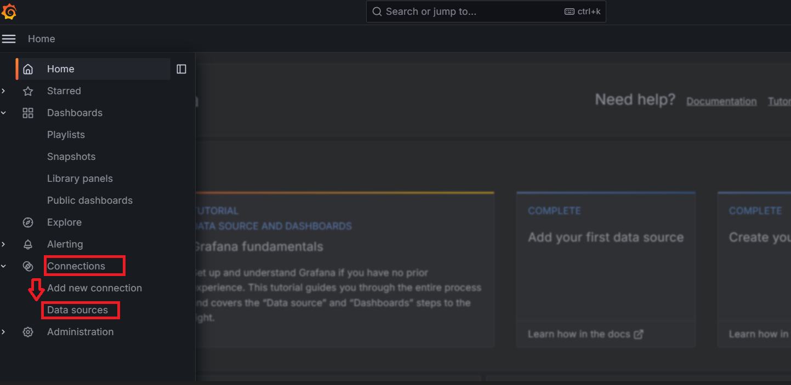

### Logic for check Performance of System 

-----

### In ActsOne now run applicaction in Docker, we will use the way for docker

## ( Docker ) => ( Setup Metric in project ) => ( Prometheus ) => ( Grafana )

#### Metric is ?

Metric is plugin for get all specifications of 1 container, node, or system run.

#### Prometheus is ?

Prometheus is opensource for get all information for Metric and then send that to Grafana for show with user view.

-----

### Step 1: Setup Grafana

```bash 
# Make the docker-compose.yml file with this content 
version: '3'
services:
  grafana:
    image: grafana/grafana:latest
    container_name: grafana
    ports:
      - "3000:3000"
    volumes:
      - /var/lib/grafana:/var/lib/grafana
    restart: always

# And then run this one 
docker-compose up -d

# Grafana will run in pod: 3000
root@serverlocal:~# docker ps
CONTAINER ID   IMAGE                               COMMAND                  CREATED          STATUS             PORTS                                       NAMES
4fcec7d72e72   grafana/grafana:latest              "/run.sh"                4 hours ago      Up About an hour   0.0.0.0:3000->3000/tcp, :::3000->3000/tcp   grafana

# Note is: Infor login default is: admin / admin 
```

### Step 2: Setup Telegraf

#### Telegraf is ?

Telegraf is an open-source tool designed for collecting, processing, and sending metrics and data from various sources within a system for monitoring and analysis purposes. It supports gathering data from diverse inputs such as logs, services, system resources, and external sources like SNMP and Docker. Telegraf can then send this collected data to storage systems like InfluxDB or other monitoring systems using protocols such as Prometheus and Graphite. It's highly flexible and extensible, allowing users to customize data collection and processing according to their specific needs.

#####
```bash 

# Setup telegraf
root@serverlocal:~# apt-get install telegraf

# Edit vào trong này để có đường dẫn Paths: / metrics
root@serverlocal:~# nano /etc/telegraf/telegraf.conf

# Tìm tới dòng này, bằng số 9273, thêm path = "metrics" vào
# # Configuration for the Prometheus client to spawn
[[outputs.prometheus_client]]
#   ## Address to listen on
    listen = ":9273"
    path = "metrics"

```

#### Khi Setup thành công
```bash

root@serverlocal:~# sudo systemctl start telegraf

root@serverlocal:~# systemctl status telegraf
● telegraf.service - The plugin-driven server agent for reporting metrics into InfluxDB
     Loaded: loaded (/lib/systemd/system/telegraf.service; enabled; vendor preset: enabled)
     Active: active (running) since Wed 2024-03-27 10:51:16 UTC; 1min 50s ago
       Docs: https://github.com/influxdata/telegraf
   Main PID: 889 (telegraf)
      Tasks: 8 (limit: 4515)
     Memory: 200.8M
        CPU: 1.875s
     CGroup: /system.slice/telegraf.service
             └─889 /usr/bin/telegraf -config /etc/telegraf/telegraf.conf -config-directory /etc/telegraf/telegraf.d

```

### Step 3: Setup Prometheus

```bash
docker run -d -p 9090:9090 --name prometheus prom/prometheus
```

#### Get this file from container prometheus run in docker and then edit: Prometheus.yaml
```bash
# my global config
global:
  scrape_interval: 15s # Set the scrape interval to every 15 seconds. Default is every 1 minute.
  evaluation_interval: 15s # Evaluate rules every 15 seconds. The default is every 1 minute.
  # scrape_timeout is set to the global default (10s).

# Alertmanager configuration
alerting:
  alertmanagers:
    - static_configs:
        - targets:
          # - alertmanager:9093

# Load rules once and periodically evaluate them according to the global 'evaluation_interval'.
rule_files:
  # - "first_rules.yml"
  # - "second_rules.yml"

# A scrape configuration containing exactly one endpoint to scrape:
# Here it's Prometheus itself.
scrape_configs:

  # The job name is added as a label `job=<job_name>` to any timeseries scraped from this config.
  - job_name: "prometheus"

    # metrics_path defaults to '/metrics'
    # scheme defaults to 'http'.

    static_configs:
      - targets: ["localhost:9090"]

  # The job name is added as a label `job=<job_name>` to any timeseries scraped from this config.
  - job_name: "prometheus"
  - job_name: "ActsOne Performance"

    # metrics_path defaults to '/metrics'
    # scheme defaults to 'http'.

    static_configs:
      # In here you can put more ip for check performance, in here I trust make example
      - targets: ["localhost:9090", "1.22.3.4:9100"] 

```

#### And then use this command 

```bash 
root@serverlocal:~# docker cp prometheus.yml prometheus:/etc/prometheus/prometheus.yml
root@serverlocal:~# docker restart prometheus
```

### Setup 4: Setup config in Grafana for show the chart like user view

* Note: In the file app.py, I have make example have added "metrics plugin in source code for get infor detail every api when they request to server "

#### 4.1: Add the Database Source


In here u can choice the prometheus and add that

----

#### Command use usual when do this project 

```bash 

# Check IP have connnect with ( prometheus service )
http://192.168.200.128:9090/targets?search=

docker run -d -p 5000:5000 --name admiring_goldwasser linhtran2023/performance_test:v06

```